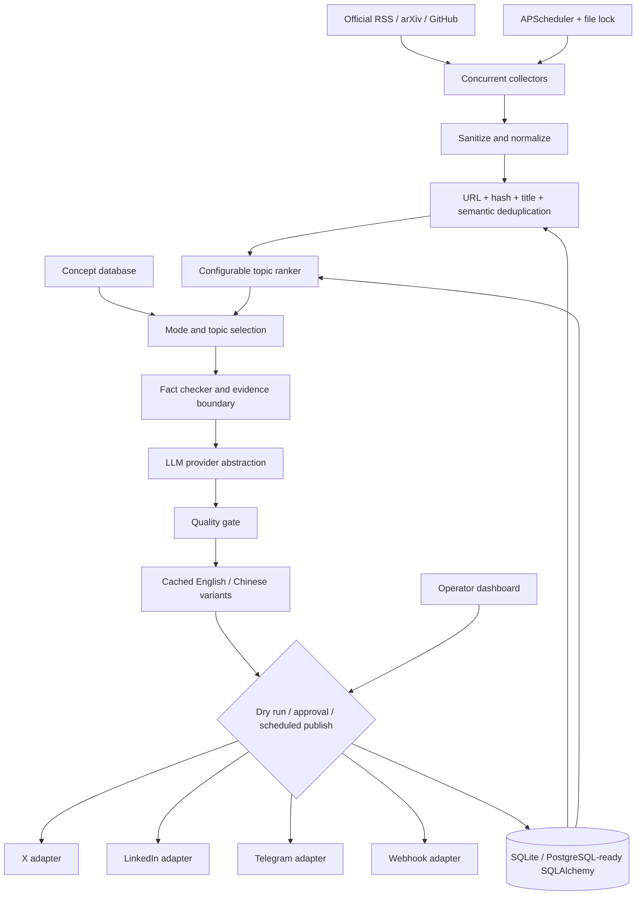

# AI Daily Content Agent

[English](README.md) | [简体中文](README.zh-CN.md)

AI Daily Content Agent is an open-source Python service that discovers recent AI developments or
selects an evergreen frontier concept, verifies the available evidence, creates a source-grounded
social post, applies a deterministic quality gate, and either queues the post for review or
publishes through explicitly configured adapters.

The default configuration is deliberately safe: it uses a deterministic local template generator,
stores output as `pending_review`, and never contacts a social publishing API. DeepSeek and other
OpenAI-compatible providers can be enabled through environment variables.

## Architecture



Pipeline steps are logged as `FETCH`, `NORMALIZE`, `DEDUP`, `RANK`, `VERIFY`, `GENERATE`,
`QUALITY_CHECK`, `PUBLISH`, and `DONE` or `FAILED`. Every log entry contains a `run_id`.

## What is implemented

- News mode with seven first-party/high-authority RSS feeds, arXiv, and GitHub Search.
- Frontier concept mode with a persisted, non-repeating concept catalog and curated references.
- Mixed mode using either news-importance selection or deterministic alternation.
- Exact and hashed n-gram/concept-vector similarity deduplication, plus publication-history checks.
- Configurable weighted ranking for recency, source quality, importance, novelty, technical
  relevance, and social interest.
- Evidence extraction, per-claim support flags, source preservation, and confidence thresholds.
- Template, DeepSeek, OpenAI, and generic OpenAI-compatible LLM providers.
- Optional, separately configured compatible image-generation endpoint.
- Quality checks for sources, confidence, unsupported claims, hype, length, unexpected numbers,
  clarity, grammar, and similarity with previous output.
- Review workflow, publication audit history, daily scheduling, concurrency protection, JSON logs,
  health endpoints, Docker deployment, and a complete CLI.
- Responsive bilingual operator dashboard with run-now, five-second progress refresh, evidence
  review, source-grounded regeneration, approval, and guarded immediate or scheduled publication.

## Quick start with Docker

Requirements: Docker Engine/Desktop with Compose v2.

```bash
cp .env.example .env
docker compose up --build -d
docker compose ps
docker compose exec app python -m app.cli run --dry-run
```

The final command fetches live public feeds, stores normalized articles in SQLite, creates one post,
prints it to the terminal, and skips all publication calls. Expected progress resembles:

```text
Fetching AI sources...
Found 42 articles
Normalizing and storing articles...
Removing duplicate stories...
Removed 7 duplicates
Ranking 35 topics...
Verifying sources...
Selected: Example topic
Generating post...
Evaluating content quality...
Quality score: 95
Saving post and evaluating publication mode...
DRY RUN — publication skipped.
DONE
```

Feed counts vary. One failed source is reported as a warning and does not abort other collectors.
If every current source is unreachable or no topic passes verification, the run is marked `failed`
rather than creating an unsupported post.

Health endpoints:

```bash
curl http://localhost:8000/health
curl http://localhost:8000/ready
curl http://localhost:8000/posts
curl http://localhost:8000/runs
```

Open the operator dashboard at [http://localhost:8000](http://localhost:8000). It reads the same
SQLite records as the CLI and lets you inspect extracted facts and source links, move through the
review queue, start the agent, regenerate a draft from feedback, and approve an English or Chinese
publication variant. After approval, choose immediate publication or a persisted future time. The
page refreshes run progress every five seconds; the delayed-publication dispatcher checks due work
every 30 seconds. With the default `DRY_RUN=true`, both paths exercise the guarded workflow but make
no social API call. Immediate and scheduled publication are mutually exclusive; revision or
regeneration cancels the old persisted schedule before a replacement draft is created.

The Chinese UI is local. The first switch to Chinese for a post asks the configured non-template LLM
to translate it, validates that source URLs and numeric claims are preserved, and stores the result
in that post's metadata. Later language switches reuse the cached variant. This first translation
therefore consumes one provider request when DeepSeek, OpenAI, or a compatible API is configured.

Compose binds the service to `127.0.0.1` by default, so the dashboard is available only on the local
machine. Set a long random `DASHBOARD_ADMIN_TOKEN` before using `ENVIRONMENT=production`; production
startup intentionally fails without it. The browser keeps that token in session storage only.

Stop the service with `docker compose down`. Add `-v` only if you intentionally want to delete the
persistent SQLite volume.

## DeepSeek configuration

DeepSeek exposes an OpenAI-compatible API. Change these values in `.env`:

```dotenv
LLM_PROVIDER=deepseek
DEEPSEEK_API_KEY=your-local-secret
DEEPSEEK_BASE_URL=https://api.deepseek.com
DEEPSEEK_MODEL=deepseek-flash
```

Model availability changes over time; use a model name enabled for your DeepSeek account. The key
is read at runtime through Pydantic `SecretStr`, never logged, and must not be committed. See the
[official DeepSeek API guide](https://api-docs.deepseek.com/guides/codex).

The zero-secret `template` provider is an honest deterministic fallback for development and CI. Its
database metadata says `offline=true`; it is never presented as an external-model result.

## Environment variables

| Variable | Default | Purpose |
| --- | --- | --- |
| `DATABASE_URL` | `sqlite:///./data/content_agent.db` | SQLAlchemy database URL |
| `TIMEZONE` | `Asia/Singapore` | IANA scheduler timezone |
| `POST_TIME` | `09:00` | Daily local time in `HH:MM` |
| `CONTENT_MODE` | `mixed` | `news`, `concept`, or `mixed` |
| `MIXED_MODE_STRATEGY` | `importance` | `importance` or `alternate` |
| `AUTO_PUBLISH` | `false` | Permit quality-approved automatic publication |
| `DRY_RUN` | `true` | Block every real publication call |
| `DASHBOARD_ADMIN_TOKEN` | empty | Required for dashboard actions in production |
| `MIN_QUALITY_SCORE` | `85` | Required score for publication |
| `MIN_VERIFICATION_CONFIDENCE` | `0.72` | Required evidence confidence |
| `LLM_PROVIDER` | `template` | `template`, `deepseek`, `openai`, or `compatible` |
| `CONTENT_STYLE` | `professional` | Content prompt style |
| `PUBLISH_PLATFORMS` | empty | Comma-separated enabled adapter names |
| `EXTRA_RSS_FEEDS` | empty | Comma-separated additional RSS URLs |
| `IMAGE_GENERATION_ENABLED` | `false` | Enable optional compatible image generation |

All ranking weights and provider/platform fields are documented in `.env.example`. Configuration is
validated at startup: selecting a remote provider without its required key fails clearly.

## Data sources

Default sources are OpenAI News, Google AI, Google DeepMind, Microsoft Research, NVIDIA AI, Hugging Face,
MIT AI News, arXiv AI categories, and GitHub AI repositories. The RSS list lives in
`app/collectors/rss.py`.

To add a feed without code, add its URL to `EXTRA_RSS_FEEDS`. It receives a conservative credibility
score. To add a first-class source:

1. Implement `Collector.fetch(client) -> CollectorResult` in `app/collectors/`.
2. Return `NormalizedArticle` values and errors; never raise for an ordinary source failure.
3. Sanitize external HTML with `sanitize_untrusted_html`.
4. Register it in `CollectorRegistry.from_settings`.
5. Add a test using `httpx.MockTransport`.

Collectors identify themselves with a respectful user agent. Review source terms and robots policies
before adding a page-scraping collector.

## LLM providers and grounded generation

`LLMProvider.complete()` is the only generation contract. `CompatibleAPIProvider` sends standard
chat-completions requests, while DeepSeek and OpenAI are configured subclasses. Prompts contain only
the claims marked supported by the verifier. Source material is delimited as untrusted JSON and the
system prompt explicitly forbids following any instruction found inside it.

Generation is rejected when verification confidence is too low. The generated post and the database
record retain source titles, URLs, source dates, extracted claims, provider/model metadata, confidence,
quality score, and the full quality report.

## Review and CLI workflow

```bash
python -m app.cli fetch
python -m app.cli rank
python -m app.cli generate --mode news
python -m app.cli run --dry-run
python -m app.cli list-posts
python -m app.cli list-pending
python -m app.cli approve 12
python -m app.cli publish 12
python -m app.cli status
```

`approve` changes only the local database status. `publish` requires an approved post and still honors
`DRY_RUN=true`. To publish manually, set `DRY_RUN=false`, configure at least one platform, restart the
service, approve the post, and run `publish`.

## Platform adapters

Adapters implement `format`, `validate`, and `publish`. Credentials are environment-only.

- **X / Twitter:** requires an official X API app and an OAuth 2.0 user-context token with write
  permission. Long posts are emitted as a thread. App-only bearer tokens cannot create posts.
- **LinkedIn:** requires approved LinkedIn API access, a member/organization author URN, and a token
  with the applicable post-writing scope. Keep `LINKEDIN_API_VERSION` aligned with LinkedIn's active
  version.
- **Telegram:** requires a bot token and a chat/channel ID where the bot can post.
- **Webhook:** sends a JSON object with post ID, title, content, sources, and image URLs. An optional
  bearer token is supported.

To add a platform, subclass `PlatformAdapter`, implement all three methods, register it in
`app/platforms/registry.py`, add environment validation, and test it with `httpx.MockTransport`.
Do not use browser automation as an API substitute.

## Scheduler and concurrency

The FastAPI lifespan starts one APScheduler cron job at `POST_TIME` in `TIMEZONE`. Jobs coalesce after
downtime and `max_instances=1` blocks overlap inside the process. A separate atomic file lock blocks
overlap across the API process and `docker compose exec` CLI runs. A stale lock expires after four
hours. `run_history` preserves status, counts, source errors, start/end times, and the current step.

Only run one scheduler-enabled replica with SQLite. For multiple production replicas, move to
PostgreSQL and replace the file lock with a database advisory lock or distributed lease.

## Local development and tests

Use Python 3.12; do not install project packages into the macOS system Python.

```bash
python3.12 -m venv .venv
source .venv/bin/activate
python -m pip install -e '.[dev]'
cp .env.example .env
pytest
ruff check app tests
uvicorn app.main:app --reload
```

Run the exact test environment in Docker:

```bash
docker build --target test -t ai-daily-content-agent:test .
docker run --rm ai-daily-content-agent:test
```

Tests never call live LLM or social APIs. HTTP interactions use mock transports.

## Database

SQLite is persisted at `/app/data/content_agent.db` in Docker. SQLAlchemy models cover:

- `sources`
- `articles`
- `topics`
- `concepts`
- `generated_posts`
- `publication_history`
- `scheduled_publications`
- `run_history`

The models use portable types and accept a PostgreSQL SQLAlchemy URL through `DATABASE_URL`. For a
long-lived production deployment, add Alembic migrations before evolving an existing schema; the MVP
uses `create_all` only to initialize missing tables.

## Security model

- `.env` and database files are ignored; Docker never copies local secret files into the image.
- No token is hardcoded, returned by health endpoints, or included in logs.
- Remote HTML is converted to inert text, active elements are removed, size is bounded, and common
  prompt-injection strings are flagged in metadata.
- External content is always treated as data. Only supported extracted claims reach the generator.
- Publishing requires configured credentials, acceptable confidence, acceptable quality, and either
  explicit approval or `AUTO_PUBLISH=true`.
- Dashboard write actions require a non-simple request header; production additionally requires the
  configured admin token. Compose exposes the dashboard on loopback only.
- The container runs as a non-root user with a read-only filesystem, writable data volume, temporary
  `/tmp`, and `no-new-privileges`.

## Troubleshooting

### Startup says a provider key is missing

The selected `LLM_PROVIDER` requires its matching key. Return to `LLM_PROVIDER=template` for offline
development or supply the secret in your untracked `.env`.

### No article passes verification

Inspect `docker compose logs app` and `python -m app.cli status`. Source outages are stored in the run
record. Increase `ARTICLE_MAX_AGE_HOURS` only if using older content is acceptable; do not lower the
verification threshold merely to force a post.

### SQLite is read-only

Use the Compose-managed `/app/data` volume. A custom bind mount must be writable by the container's
non-root `agent` user.

### A run says another run is active

Let the existing job finish. The lock is removed on normal or failed exit and automatically treated as
stale after four hours.

### A social API rejects publication

Confirm official API approval, token scopes, author/chat identifiers, and current vendor API version.
Failures are stored in `publication_history`; the application does not fabricate success responses.

## License

MIT. See `LICENSE`.
